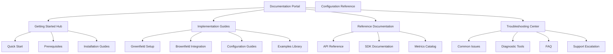

# Design Document: CloudWatch APM Public Documentation

## Overview

This design outlines a comprehensive documentation system for CloudWatch Application Performance Monitoring (APM) that serves both greenfield and brownfield customers. The documentation will be structured as a modern, searchable web-based system with clear navigation paths, practical examples, and progressive disclosure of complexity.

The design emphasizes user journey-based organization, ensuring customers can quickly find relevant information whether they're just getting started or implementing advanced configurations. The system will leverage modern documentation best practices including interactive examples, contextual help, and cross-referenced content.

## Architecture

### Information Architecture

The documentation follows a hybrid organizational structure combining:

1. **User Journey Organization**: Primary navigation based on customer progression (Getting Started → Implementation → Optimization → Troubleshooting)
2. **Topic-Based Organization**: Secondary navigation within sections organized by functional areas
3. **Audience-Based Pathways**: Dedicated entry points for different user types (developers, operations, architects)

### Content Delivery Architecture



### Technical Architecture

The documentation system will be built using:
- **Static Site Generator**: For fast loading and SEO optimization
- **Component-Based Design**: Reusable content blocks and interactive elements
- **Search Integration**: Full-text search with faceted filtering
- **Analytics Integration**: Usage tracking for continuous improvement
- **Responsive Design**: Mobile-first approach for accessibility

## Components and Interfaces

### Primary Navigation Component

**Purpose**: Main navigation system providing access to all major documentation sections

**Interface**:
- Top-level categories with hover/click expansion
- Breadcrumb navigation for deep pages
- Progress indicators for multi-step guides
- Quick access to search functionality

**Behavior**:
- Persistent navigation across all pages
- Context-aware highlighting of current section
- Responsive collapse for mobile devices

### Content Section Components

#### Getting Started Hub
- **Quick Start Wizard**: Interactive setup flow
- **Platform Selector**: Dynamic content based on user's technology stack
- **Progress Tracker**: Visual indication of setup completion
- **Verification Tools**: Built-in checks for successful configuration

#### Implementation Guides
- **Scenario Selector**: Choose between greenfield/brownfield paths
- **Code Examples**: Syntax-highlighted, copyable code blocks
- **Interactive Tutorials**: Step-by-step guided implementations
- **Architecture Diagrams**: Visual representations of integration patterns

#### Reference Documentation
- **API Explorer**: Interactive API documentation with try-it functionality
- **Configuration Builder**: Form-based configuration generation
- **Metrics Browser**: Searchable catalog of available metrics
- **SDK Code Samples**: Language-specific implementation examples

#### Troubleshooting Center
- **Issue Classifier**: Guided problem identification
- **Diagnostic Runner**: Automated health checks and validation
- **Solution Database**: Searchable repository of solutions
- **Escalation Pathways**: Clear routes to additional support

### Search and Discovery Interface

**Components**:
- **Global Search Bar**: Prominent search with autocomplete
- **Faceted Filters**: Filter by content type, audience, difficulty level
- **Related Content**: Contextual suggestions based on current page
- **Popular Content**: Trending and most-accessed documentation

### Interactive Elements

#### Code Examples Component
- **Multi-language Support**: Tabbed interface for different programming languages
- **Copy-to-Clipboard**: One-click code copying
- **Live Editing**: In-browser code modification and testing
- **Download Options**: Complete example projects

#### Configuration Wizard
- **Step-by-Step Forms**: Guided configuration creation
- **Validation**: Real-time configuration validation
- **Export Options**: Generate configuration files in multiple formats
- **Template Library**: Pre-built configurations for common scenarios

## Data Models

### Content Structure Model

```typescript
interface DocumentationPage {
  id: string;
  title: string;
  description: string;
  audience: UserAudience[];
  difficulty: DifficultyLevel;
  category: ContentCategory;
  tags: string[];
  content: ContentBlock[];
  relatedPages: string[];
  lastUpdated: Date;
  estimatedReadTime: number;
}

interface ContentBlock {
  type: 'text' | 'code' | 'diagram' | 'interactive' | 'video';
  content: string;
  metadata: BlockMetadata;
}

interface UserAudience {
  type: 'developer' | 'operations' | 'architect' | 'security';
  experience: 'beginner' | 'intermediate' | 'advanced';
}
```

### Navigation Model

```typescript
interface NavigationStructure {
  sections: NavigationSection[];
  breadcrumbs: BreadcrumbItem[];
  contextualLinks: ContextualLink[];
}

interface NavigationSection {
  id: string;
  title: string;
  icon: string;
  subsections: NavigationSubsection[];
  landingPage: string;
}

interface NavigationSubsection {
  id: string;
  title: string;
  pages: DocumentationPage[];
  estimatedCompletionTime: number;
}
```

### User Journey Model

```typescript
interface UserJourney {
  id: string;
  name: string;
  description: string;
  audience: UserAudience;
  steps: JourneyStep[];
  estimatedDuration: number;
}

interface JourneyStep {
  id: string;
  title: string;
  description: string;
  requiredPages: string[];
  optionalPages: string[];
  completionCriteria: string[];
  nextSteps: string[];
}
```

## Correctness Properties

*A property is a characteristic or behavior that should hold true across all valid executions of a system—essentially, a formal statement about what the system should do. Properties serve as the bridge between human-readable specifications and machine-verifiable correctness guarantees.*

Before defining the correctness properties, I need to analyze the acceptance criteria to determine which ones are testable through automated means.

<function_calls>
<invoke name="prework">
<parameter name="featureName">cloudwatch-apm-docs

### Property Reflection

After analyzing all acceptance criteria, I identified several areas where properties can be consolidated:

**Content Existence Properties**: Many criteria test for the existence of specific content types (guides, examples, documentation). These can be grouped into comprehensive content coverage properties.

**Cross-Reference Properties**: Multiple criteria require related content and cross-references. These can be combined into link integrity properties.

**Completeness Properties**: Several criteria require "complete" documentation of APIs, configurations, etc. These can be unified into completeness validation properties.

**Organization Properties**: Multiple criteria require proper categorization and organization. These can be combined into structural integrity properties.

Based on this analysis, the following properties provide comprehensive coverage while eliminating redundancy:

### Correctness Properties

Property 1: **Navigation Structure Integrity**
*For any* documentation page, the navigation structure should contain a valid hierarchical path from root to that page, and all navigation links should resolve to existing pages.
**Validates: Requirements 1.1, 1.2, 1.4**

Property 2: **Content Organization by Journey Stage**
*For any* piece of content, it should be properly categorized into exactly one primary journey stage (getting started, implementation, troubleshooting, advanced topics) and contain appropriate metadata for that stage.
**Validates: Requirements 1.3**

Property 3: **Search Functionality Coverage**
*For any* searchable content, the search system should return that content when queried with relevant terms from its title, description, or tags.
**Validates: Requirements 1.5**

Property 4: **Platform Coverage Completeness**
*For any* supported platform, installation instructions should exist and follow the standard step-by-step format with verification steps.
**Validates: Requirements 2.3, 2.5**

Property 5: **Configuration Documentation Completeness**
*For any* configuration parameter in the CloudWatch APM system, that parameter should be documented with description, valid values, examples, and validation guidance.
**Validates: Requirements 4.1, 4.3, 4.4**

Property 6: **Code Example Language Coverage**
*For any* supported programming language, code examples should exist for all major integration scenarios and follow consistent formatting standards.
**Validates: Requirements 6.1, 7.5**

Property 7: **API Documentation Completeness**
*For any* API endpoint in the CloudWatch APM service, that endpoint should be documented with parameters, responses, authentication requirements, and usage examples.
**Validates: Requirements 7.1, 7.3, 7.4**

Property 8: **Cross-Reference Link Integrity**
*For any* cross-reference link within the documentation, the target should exist and be accessible, and related content should have bidirectional references where appropriate.
**Validates: Requirements 1.4**

Property 9: **Troubleshooting Coverage Completeness**
*For any* common error or issue category, troubleshooting documentation should exist with diagnostic steps, solutions, and escalation paths.
**Validates: Requirements 5.1, 5.2, 5.3, 5.4**

Property 10: **Content Metadata Consistency**
*For any* documentation page, all required metadata fields (audience, difficulty, category, tags, estimated read time) should be present and follow the defined schema.
**Validates: Requirements 1.3, 2.2**

## Error Handling

### Content Validation Errors

**Missing Required Content**: When required content sections are missing, the system should:
- Log specific missing content types and locations
- Provide clear error messages indicating what content needs to be added
- Prevent publication of incomplete documentation sections
- Generate reports for content authors identifying gaps

**Broken Links and References**: When cross-references or external links are broken, the system should:
- Automatically detect broken internal and external links
- Provide alternative suggestions for broken references
- Maintain a quarantine list of problematic links
- Generate alerts for content maintainers

**Inconsistent Metadata**: When content metadata is missing or inconsistent, the system should:
- Validate all metadata fields against defined schemas
- Provide default values for optional fields
- Flag inconsistencies for manual review
- Prevent content from appearing in filtered views until corrected

### User Experience Errors

**Search Failures**: When search functionality fails or returns no results, the system should:
- Provide alternative search suggestions
- Display popular content as fallback options
- Log search queries for analysis and improvement
- Offer direct contact options for complex queries

**Navigation Errors**: When users encounter navigation issues, the system should:
- Provide breadcrumb navigation for context
- Offer alternative pathways to desired content
- Log navigation patterns for UX improvement
- Display site map as fallback navigation option

**Content Loading Errors**: When content fails to load properly, the system should:
- Display cached versions when available
- Provide offline-capable content for critical sections
- Show clear error messages with retry options
- Maintain service status indicators

### Integration Errors

**API Documentation Sync**: When API documentation becomes out of sync with actual APIs, the system should:
- Automatically detect version mismatches
- Flag outdated documentation for review
- Provide version comparison tools
- Maintain historical documentation versions

**Example Code Validation**: When code examples become outdated or non-functional, the system should:
- Automatically test code examples against current APIs
- Flag failing examples for developer review
- Provide version-specific example variations
- Maintain example code in version control

## Testing Strategy

### Dual Testing Approach

The documentation system will employ both unit testing and property-based testing to ensure comprehensive coverage and correctness:

**Unit Tests** will focus on:
- Specific content validation scenarios
- Individual component functionality
- Integration points between documentation sections
- Edge cases in search and navigation
- Error handling for specific failure modes

**Property-Based Tests** will focus on:
- Universal properties that hold across all content
- Comprehensive input coverage through randomization
- Structural integrity across the entire documentation system
- Cross-reference validation across all pages
- Metadata consistency across all content types

### Property-Based Testing Configuration

The testing framework will use **Hypothesis** (Python) for property-based testing with the following configuration:
- **Minimum 100 iterations** per property test to ensure thorough coverage
- **Custom generators** for documentation content, navigation structures, and metadata
- **Shrinking strategies** to identify minimal failing examples
- **Stateful testing** for user journey validation

Each property test will be tagged with comments referencing the design document property:
- **Feature: cloudwatch-apm-docs, Property 1: Navigation Structure Integrity**
- **Feature: cloudwatch-apm-docs, Property 2: Content Organization by Journey Stage**
- And so forth for all properties

### Unit Testing Strategy

Unit tests will complement property tests by focusing on:
- **Specific Examples**: Testing known good and bad content structures
- **Integration Testing**: Verifying connections between documentation components
- **Edge Cases**: Testing boundary conditions for search, navigation, and content loading
- **Error Conditions**: Validating proper error handling and user feedback

### Continuous Validation

The testing strategy includes continuous validation through:
- **Pre-publication Testing**: All content changes validated before going live
- **Periodic Full System Validation**: Complete property test suite run on schedule
- **User Journey Testing**: Automated testing of complete user workflows
- **Performance Testing**: Ensuring documentation system meets performance requirements

### Test Data Management

Testing will utilize:
- **Synthetic Content Generation**: Automated generation of test documentation content
- **Real Content Sampling**: Testing against actual documentation content
- **User Behavior Simulation**: Simulated user interactions for journey testing
- **API Integration Testing**: Validation against actual CloudWatch APM APIs

This comprehensive testing approach ensures that the documentation system maintains high quality, accuracy, and usability while supporting both automated validation and human review processes.